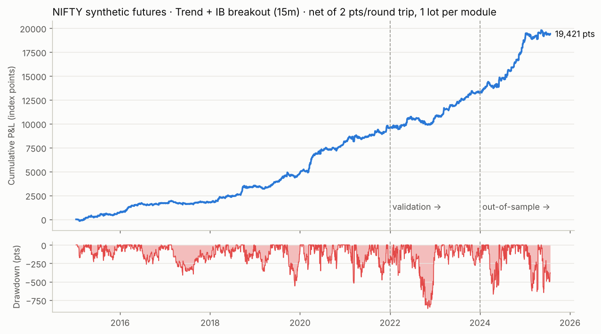

# NIFTY 50 synthetic futures: Trend + IB breakout (15 min)

Pine script: [`NIFTY_SYN_TREND_IB.pine`](NIFTY_SYN_TREND_IB.pine). Add it to a **15-minute** chart of `NSE:NIFTY`
(or `NSE:NIFTY1!`) on TradingView. It is a full backtester: results appear in the Strategy Tester, and an on-chart dashboard
shows per-module trades, win %, PF, net points / ₹, max DD and live bias. Inputs add a backtest date range and a long/short-only switch.
Full 2015+ history in TradingView needs Deep Backtesting, because 15-minute charts load a limited number of bars.

## The strategy

Two independent modules trade 1 lot each and share one net position. The position never exceeds 2 lots and never holds opposite directions.

| | **A: Trend** | **B: Initial-balance (IB) breakout** |
|---|---|---|
| Setup | Supertrend(30, 3) up **and** close > EMA(100) **and** last closed 60m bar's close > its EMA(50) | 15m close crosses above the 09:15–10:15 high (below the low for shorts) |
| Bias filter | (the 60m filter above) | previous session close > 20-day EMA of session closes (< for shorts) |
| Trigger | *fresh* confluence: all three agree on this bar but not on the previous one | the crossing bar |
| Entry window | 10:00 – 14:30 | 10:15 – 14:30, max 2 entries/day |
| Stop / target | 1.5 × ATR(14) / 4 × ATR(14) | 1.5 × ATR(14) / 3 × IB width |
| Other exit | Supertrend flips | none |
| Square-off | close of the bar ending 15:15 | close of the bar ending 15:15 |

Shorts mirror longs. To execute the synthetic future at the nearest expiry, ATM strike:
- **LONG:** buy CE + sell PE
- **SHORT:** sell CE + buy PE

Every order carries an `alert_message`, so TradingView alerts can drive execution.

## Back-test results

Data: 1-minute NIFTY 50 spot, 2015-01-09 → 2025-07-25 (975k bars, 2,599 regular sessions; muhurat/special sessions removed).
Cost: **2 index points per round trip** per unit. Fills at the close of the signal bar (`process_orders_on_close`). Stops and targets are checked intrabar, and if both are hit in the same bar the stop is assumed (conservative).

| Period | Role | Sharpe (daily, ann.) | Points |
|---|---|---|---|
| 2015–2021 | train (rules chosen here) | 1.81 | 9,812 |
| 2022–2023 | validation | 1.78 | 3,881 |
| 2024 → Jul-2025 | **out-of-sample** | **2.33** | 6,179 |
| Full | | 1.83 | **19,421** |

2,062 trades · profit factor 1.50 · win rate 49.7% · max drawdown 863 pts (Nov-2022) · 69% of months positive.

### Year by year (both modules, 1 lot each, ₹ at lot size 65)

| Year | Trades | Points | Trend | IB | PF | Sharpe | Max DD | ₹ (65 units) |
|---|---|---|---|---|---|---|---|---|
| 2015 | 183 | 746 | 231 | 515 | 1.29 | 1.31 | 229 | 48,477 |
| 2016 | 193 | 977 | 645 | 332 | 1.42 | 1.86 | 263 | 63,527 |
| 2017 | 175 | 74 | 104 | −29 | 1.04 | 0.17 | 411 | 4,839 |
| 2018 | 201 | 1,665 | 860 | 805 | 1.63 | 2.37 | 257 | 1,08,229 |
| 2019 | 208 | 1,370 | 910 | 460 | 1.42 | 1.93 | 556 | 89,062 |
| 2020 | 185 | 3,258 | 1,304 | 1,954 | 1.95 | 3.06 | 352 | 2,11,754 |
| 2021 | 199 | 1,475 | 611 | 864 | 1.30 | 1.43 | 518 | 95,891 |
| 2022 | 208 | 1,075 | 878 | 198 | 1.19 | 0.94 | 863 | 69,897 |
| 2023 | 195 | 2,605 | 909 | 1,696 | 1.77 | 2.85 | 279 | 1,69,344 |
| 2024 | 195 | 5,542 | 3,749 | 1,793 | 2.15 | 3.25 | 669 | 3,60,232 |
| 2025 (to Jul) | 120 | 633 | 368 | 265 | 1.15 | 0.67 | 647 | 41,117 |

### Cost sensitivity (points per round trip)

| Cost | 0 | 1 | **2** | 3 | 4 | 5 |
|---|---|---|---|---|---|---|
| Net points | 23,545 | 21,483 | **19,421** | 17,359 | 15,297 | 13,235 |
| Sharpe | 2.22 | 2.03 | **1.83** | 1.64 | 1.45 | 1.25 |
| Out-of-sample Sharpe | 2.56 | 2.44 | **2.33** | 2.21 | 2.09 | 1.97 |

### The last two months (26-May → 25-Jul-2025)

These two months were a tight range-bound market (NIFTY roughly 24,500–25,500):
- Trend module: **+146 pts** over 22 trades.
- IB breakout module: **−339 pts** (false breakouts).
- Combined: **−193 pts**, well inside the historical drawdown envelope.

The rules were **not** tuned on these two months on purpose. A strategy fitted to 40 sessions would almost certainly fail on the next 40.

## How the strategy was found (what was tested)

All of the families below were run on 3 / 5 / 10 / 15 / 30 / 60-minute bars. The rules were picked on 2015–21, checked on 2022–23, and only then run on 2024–25.

| Family | Combos | Verdict |
|---|---|---|
| Supertrend + EMA / RSI / MACD / ADX / higher-TF filters, ATR stops/targets | 15,840 + 32,256 refined | **Best.** Strong cluster at 15m, ST(14–40, 3), EMA 50–100, 60m trend filter |
| EMA crossovers + EMA-ribbon alignment + RSI / ADX / HTF filters | 3,200 | Works on 15–30m, weaker than Supertrend |
| Opening-range breakout (15/30/45/60/75/90 min) with bias filters | 11,520 + 16,128 refined | 60-min IB + daily bias holds out of sample; the fancier variants overfit |
| Previous-day high/low breakout | 576 | Weak (train Sharpe < 0.5), rejected |
| Mean reversion (RSI-2/7/14 extremes, Bollinger, ADX < x) | 756 | Loses money after costs in every period, rejected |

Robustness checks behind the choice:
- **Neighbourhood scoring.** A config only ranks high if the configs next to it (one parameter changed) also score well.
- **Neighbours of the final trend module are all positive out of sample.** Every tested neighbour (ST 20–40 × 2.5–3.5, EMA 50/100/200, three exit variants) has out-of-sample Sharpe between 1.26 and 2.79.
- **The two modules diversify each other.** Their daily P&L correlation is only 0.24.

## TradingView sizing (fixed)

The first version of the script passed `qty = 65` straight to the Strategy Tester. On symbols with a point value ≠ 1 (TradingView reports 50 for `NSE:NIFTY1!`), every trade became 65 × 50 = 3,250 units, about 50 lots. That is why one test showed ₹6.48 cr P&L and a "153%" drawdown: ₹6.48 cr ÷ 3,250 ≈ 19,950 pts, and the 2015 drawdown of 229 pts × 3,250 = ₹7.4 L on ₹5 L capital.

The script now sends `qty = units / syminfo.pointvalue`. Its dashboard computes points and ₹ from entry/exit prices, net of a cost input, so the dashboard is correct on any symbol. On a futures symbol, also set *Properties → Commission* to `<point value>` INR per contract; the dashboard tells you the value.

## Expected TradingView result (same data, same P&L arithmetic)

`research/tvreport.py` re-runs the back-test the way the Strategy Tester calculates it:
- **Data:** NSE:NIFTY spot, 15m.
- **Fills:** at the close of the signal bar.
- **Stops and targets:** TradingView's intrabar path rule. No bar ever touches both, so the rule changes nothing.
- **EMAs:** TradingView's seeding.
- **P&L:** (exit − entry) × direction × 65 units, minus a commission of 1 INR/unit/side, on ₹5,00,000 capital.

On `NSE:NIFTY`, 15m, 09-Jan-2015 → 25-Jul-2025, the Strategy Tester should show approximately:

| Total P&L | Max drawdown | Profitable trades | Profit factor |
|---|---|---|---|
| +₹12,65,448 (+253%) | ₹56,119 (4.7% of peak equity, 03-Nov-2022) | 49.8% (1027/2064) | 1.50 |

Per-year figures are in `results/tv_expected.txt`. Small differences can come from TradingView's own NIFTY prints and from special sessions (muhurat, Saturday DR drills), which this data set excludes.

## Execution-delay check

| Fill assumption | Net pts | Sharpe | Max DD |
|---|---|---|---|
| Close of the signal bar (Pine model) | 19,421 | 1.83 | 863 |
| Open of the next 1-min bar | 19,307 | 1.83 | 866 |
| Close of the next 1-min bar (1 min late) | 17,507 | 1.67 | 891 |

Drawdown is 863 pts on daily closes, 863 trade-by-trade, and 887 if open trades are marked at their worst intrabar price.

## Caveats (read before trading it)

* **Spot vs futures.** The back-test uses the spot index, whose 1-min prints are slightly stale (constituents trade asynchronously). That can flatter short-horizon trend signals. A TradingView run on `NSE:NIFTY1!` (real futures prints) showed a lower profit factor (~1.30 before costs) and a ~2,500-pt drawdown in 2026, a period after the end of this data set. Treat the futures run as the more realistic estimate.

* **Spot index used as a proxy.** The back-test uses NIFTY spot as the price of the synthetic future. Intraday moves track closely, but the futures basis and expiry-day option behaviour are not modelled.
* **Costs on four option fills.** A synthetic round trip is 4 option fills: brokerage, STT on the sell legs, exchange fees and bid-ask spread. That can exceed 2 pts, so check your own all-in cost. The edge survives 5 pts (Sharpe 1.25).
* **TradingView fills.** TradingView's broker emulator decides stop-vs-target order inside a bar from the open, whereas the Python model always assumes the stop. Expect small differences between the TV report and these numbers; the Python model is the more conservative of the two.
* **Margin.** A synthetic lot needs roughly futures-equivalent margin. With 1 lot per module, the historical max drawdown is ~863 pts ≈ ₹56k at 65 units. Plan capital for at least 2× that.
* **Past results.** A back-test is not a guarantee. Paper-trade or forward-test it first.

## Reproducing

`research/` contains the full pipeline:
- `load.py`: cleans the CSV.
- `engine.py`: resampling, Pine-exact indicators (`ta.supertrend`, `ta.atr`, `ta.rsi`, MACD, ADX) and a numba simulator.
- `search.py`, `refine.py`, `orbref.py`: the grid searches.
- `joint.py`, `runjoint.py`: an exact replica of the Pine execution model.
- `yearly.py`, `plot_equity.py`: the reports.

The scripts expect the 1-minute CSV in a local `data/` scratch directory; set `SCR` in `engine.py`.
`results/` holds every trade (`trades_final.csv`), daily equity (`equity_final.csv`) and the yearly table.
